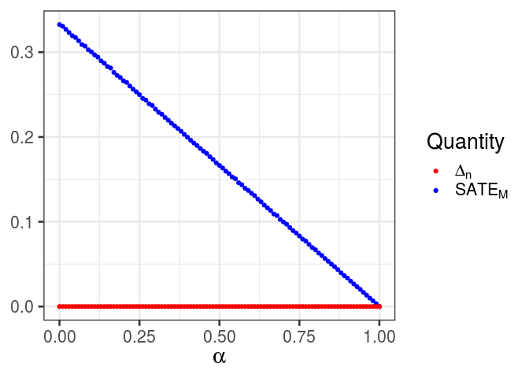

Simulations of examples in appendices
================
Gaebler et al.
Tuesday, October 11, 2020

``` r
library(glue)
library(magrittr)
library(tidyverse)
```

    ## ── Attaching packages ─────────────────────────────────────── tidyverse 1.3.0 ──

    ## ✔ ggplot2 3.3.2     ✔ purrr   0.3.4
    ## ✔ tibble  3.0.3     ✔ dplyr   1.0.0
    ## ✔ tidyr   1.1.0     ✔ stringr 1.4.0
    ## ✔ readr   1.3.1     ✔ forcats 0.4.0

    ## ── Conflicts ────────────────────────────────────────── tidyverse_conflicts() ──
    ## ✖ dplyr::collapse()  masks glue::collapse()
    ## ✖ tidyr::extract()   masks magrittr::extract()
    ## ✖ dplyr::filter()    masks stats::filter()
    ## ✖ dplyr::lag()       masks stats::lag()
    ## ✖ purrr::set_names() masks magrittr::set_names()

``` r
# Simulate in a population of 1,000,000.
pop_size <- 1e6

# Fix random seed.
set.seed(0)

# Print three digits only.
options(digits = 3)

# Set the ggplot theme.
theme_set(theme_bw(base_size = 20))

# Output results at the end of the chunk.
knitr::opts_chunk$set(results = "hold")
```

# Overview

This notebook contains simulations of the examples constructed in the
proofs of Theorem A.5 and Proposition B.1 in the appendices of *A Causal
Framework for Observational Studies of Discrimination*, complementing
the proofs contained there.

Each simulation generates a “book of life,” i.e., the complete set of
potential outcomes for a population, drawn according to the joint
distribution defined in the corresponding example.

# Case 2: Subset ignorability does not imply sequential ignorability

``` r
case_2_book_of_life <- tibble(
  Y_b_1 = 1L,
  Y_w_1 = 1L,
  Z = rbinom(pop_size, 1, 1/2),
  M_b = if_else(Z == 1, 1L, rbinom(pop_size, 1, 1/2)),
  M_w = if_else(Z == 1, 1L, rbinom(pop_size, 1, 1/2)),
  M = if_else(Z == 1, M_b, M_w),
  Y = if_else(M == 1, if_else(Z == 1, Y_b_1, Y_w_1), 0L)
)

# Subset ignorability holds.
cat("## SUBSET IGNORABILITY HOLDS.\n")
case_2_book_of_life %>%
  filter(M == 1) %>%
  group_by(Z) %>%
  summarize(across(c(Y_b_1, Y_w_1), mean), .groups = "drop") %>%
  pivot_longer(
    c(Y_b_1, Y_w_1),
    names_to = "po",
    values_to = "mean"
  ) %>%
  arrange(po) %>%
  pmap_chr(
    glue,
    "For individuals with Z = { Z }, the mean of { po } is { format(mean) }.\n",
    .trim = FALSE
  ) %>%
  walk(cat)

# Sequential ignorability fails.
cat("\n## SEQUENTIAL IGNORABILITY FAILS.\n")
case_2_book_of_life %>%
  group_by(Z) %>%
  summarize(across(c(M_b, M_w), mean), .groups = "drop") %>%
  pivot_longer(
    c(M_b, M_w),
    names_to = "po",
    values_to = "mean"
  ) %>%
  arrange(po) %>%
  pmap_chr(
    glue,
    "For individuals with Z = { Z }, the mean of { po } is { format(mean) }.\n",
    .trim = FALSE
  ) %>%
  walk(cat)
```

    ## ## SUBSET IGNORABILITY HOLDS.
    ## For individuals with Z = 0, the mean of Y_b_1 is 1.
    ## For individuals with Z = 1, the mean of Y_b_1 is 1.
    ## For individuals with Z = 0, the mean of Y_w_1 is 1.
    ## For individuals with Z = 1, the mean of Y_w_1 is 1.
    ## 
    ## ## SEQUENTIAL IGNORABILITY FAILS.
    ## For individuals with Z = 0, the mean of M_b is 0.499.
    ## For individuals with Z = 1, the mean of M_b is 1.
    ## For individuals with Z = 0, the mean of M_w is 0.501.
    ## For individuals with Z = 1, the mean of M_w is 1.

# Case 3: Consistency of  does not imply subset ignorability holds

``` r
case_3_book_of_life <- tibble(
  Z = rbinom(pop_size, 1, 1/2),
  M = 1L,
  Y_b_1 = if_else(Z == 1, 1L, rbinom(pop_size, 1, 1/2)),
  Y_w_1 = if_else(Z == 1, 0L, rbinom(pop_size, 1, 1/2)),
  Y = if_else(M == 1, if_else(Z == 1, Y_b_1, Y_w_1), 0L)
)

# Δ_n is a consistent estimator.
cat("## Δ_n IS A CONSISTENT ESTIMATOR.\n")
SATE_M <- case_3_book_of_life %>%
  filter(M == 1) %>%
  with(mean(Y_b_1 - Y_w_1)) %>%
  format()
Delta_n <- case_3_book_of_life %>%
  filter(M == 1) %>%
  group_by(Z) %>%
  summarize(Y = mean(Y), .groups = "drop") %>%
  with(Y[Z == 1] - Y[Z == 0]) %>%
  format()
cat(glue(
  "The true SATE_M is { SATE_M } and Δ_n is { Delta_n }.\n",
  .trim = FALSE
))

# Subset ignorability holds.
cat("\n## SUBSET IGNORABILITY FAILS.\n")
case_3_book_of_life %>%
  filter(M == 1) %>%
  group_by(Z) %>%
  summarize(across(c(Y_b_1, Y_w_1), mean), .groups = "drop") %>%
  pivot_longer(
    c(Y_b_1, Y_w_1),
    names_to = "po",
    values_to = "mean"
  ) %>%
  arrange(po) %>%
  pmap_chr(
    glue,
    "For individuals with Z = { Z }, the mean of { po } is { format(mean) }.\n",
    .trim = FALSE
  ) %>%
  walk(cat)
```

    ## ## Δ_n IS A CONSISTENT ESTIMATOR.
    ## The true SATE_M is 0.5 and Δ_n is 0.501.
    ## 
    ## ## SUBSET IGNORABILITY FAILS.
    ## For individuals with Z = 0, the mean of Y_b_1 is 0.5.
    ## For individuals with Z = 1, the mean of Y_b_1 is 1.
    ## For individuals with Z = 0, the mean of Y_w_1 is 0.499.
    ## For individuals with Z = 1, the mean of Y_w_1 is 0.

<h2>

Case 6: Treatment ignorability does not imply
 is a consistent estimator of the


</h2>

``` r
gen_case_6_book_of_life <- function(alpha) {
  tibble(
    Z = rbinom(pop_size, 1, 1/2),
    M_b = 1L,
    M_w = rbinom(pop_size, 1, 1/2),
    Y_b_1 = 1L,
    Y_w_1 = if_else(M_w == 0, rbinom(pop_size, 1, alpha), 1L),
    M = if_else(Z == 1, M_b, M_w),
    Y = if_else(M == 1, if_else(Z == 1, Y_b_1, Y_w_1), 0L)
  )
}

extract_estimator_and_estimand <- function(book_of_life) {
  book_of_life %<>%
    filter(M == 1)

  SATE_M <- book_of_life %>%
    with(mean(Y_b_1 - Y_w_1))

  Delta_n <- book_of_life %>%
    group_by(Z) %>%
    summarize(Y = mean(Y), .groups = "drop") %>%
    with(Y[Z == 1] - Y[Z == 0])

  tibble(SATE_M = SATE_M, Delta_n = Delta_n)
}

# Do a grid search over alpha between 0 and 1, and plot the results.
seq(0, 1, length.out = 101) %>%
  map_dfr(compose(extract_estimator_and_estimand, gen_case_6_book_of_life)) %>%
  mutate(alpha = seq(0, 1, length.out = 101)) %>%
  pivot_longer(cols = c(SATE_M, Delta_n)) %>%
  ggplot(aes(x = alpha, y = value, color = name)) +
  scale_color_manual(
    values = c("red", "blue"),
    labels = c(expr(Delta[n]), expr(SATE[M]))
  ) +
  geom_point() +
  labs(
    x = expr(alpha),
    y = NULL,
    color = "Quantity"
  )
```

<!-- -->

# Proposition B.1

Since Proposition B.1 concerns DAGs, we simulate joint distribution by
directly implementing the structural causal model.

``` r
f_Z <- identity
f_Q <- identity

f_M <- function(z, q, u_M) {
  val <- (1 + z) * (((q == 1) + (z == 1 & q == 3) + (z == 0 & q == 2)) / 2)
  return(as.integer(u_M <= val))
}

f_Y <- function(z, m, q, u_Y) {
  val <- (1 + z) * ((q == 1) / 2)
  return(m * as.integer(u_Y <= val))
}

prop_b_1_book_of_life <- tibble(
  # Generate the exogenous variables.
  U_Z = rbinom(pop_size, 1, 1/2),
  U_Q = sample(1:4, pop_size, replace = TRUE),
  U_M = runif(pop_size),
  U_Y = runif(pop_size),

  # Generate the endogenous variables.
  Z = f_Z(U_Z),
  Q = f_Q(U_Q),
  M = f_M(Z, Q, U_M),
  Y = f_Y(Z, M, Q, U_Y),

  # Generate the potential outcomes.
  M_b = f_M(1L, Q, U_M),
  M_w = f_M(0L, Q, U_M),
  Y_b_1 = f_Y(1L, 1L, Q, U_Y),
  Y_w_1 = f_Y(0L, 1L, Q, U_Y)
)

# Mediator ignorability is violated.
cat("## MEDIATOR IGNORABILITY FAILS.\n")
prop_b_1_book_of_life %>%
  filter(M_b == 1) %>%
  group_by(Z, M_w) %>%
  summarize(mean = mean(Y_b_1), .groups = "drop") %>%
  pmap_chr(glue,
    "For individuals with Z = { Z }, M_b = 1, and M_w = { M_w }, ",
    "the probability that Y_b_1 = 1 is { format(mean) }.\n",
    .trim = FALSE
  ) %>%
  walk(cat)

# Subset ignorability holds.
cat("\n## SUBSET IGNORABILITY HOLDS.\n")
prop_b_1_book_of_life %>%
  filter(M == 1) %>%
  group_by(Z) %>%
  summarize(across(c(Y_b_1, Y_w_1), mean), .groups = "drop") %>%
  pivot_longer(
    c(Y_b_1, Y_w_1),
    names_to = "po",
    values_to = "mean"
  ) %>%
  arrange(po) %>%
  pmap_chr(
    glue,
    "For individuals with Z = { Z }, the mean of { po } is { format(mean) }.\n",
    .trim = FALSE
  ) %>%
  walk(cat)
```

    ## ## MEDIATOR IGNORABILITY FAILS.
    ## For individuals with Z = 0, M_b = 1, and M_w = 0, the probability that Y_b_1 = 1 is 0.333.
    ## For individuals with Z = 0, M_b = 1, and M_w = 1, the probability that Y_b_1 = 1 is 1.
    ## For individuals with Z = 1, M_b = 1, and M_w = 0, the probability that Y_b_1 = 1 is 0.334.
    ## For individuals with Z = 1, M_b = 1, and M_w = 1, the probability that Y_b_1 = 1 is 1.
    ## 
    ## ## SUBSET IGNORABILITY HOLDS.
    ## For individuals with Z = 0, the mean of Y_b_1 is 0.501.
    ## For individuals with Z = 1, the mean of Y_b_1 is 0.5.
    ## For individuals with Z = 0, the mean of Y_w_1 is 0.248.
    ## For individuals with Z = 1, the mean of Y_w_1 is 0.251.
