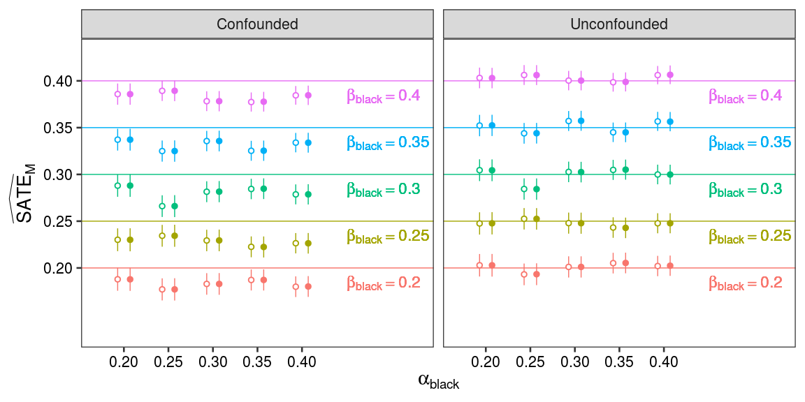
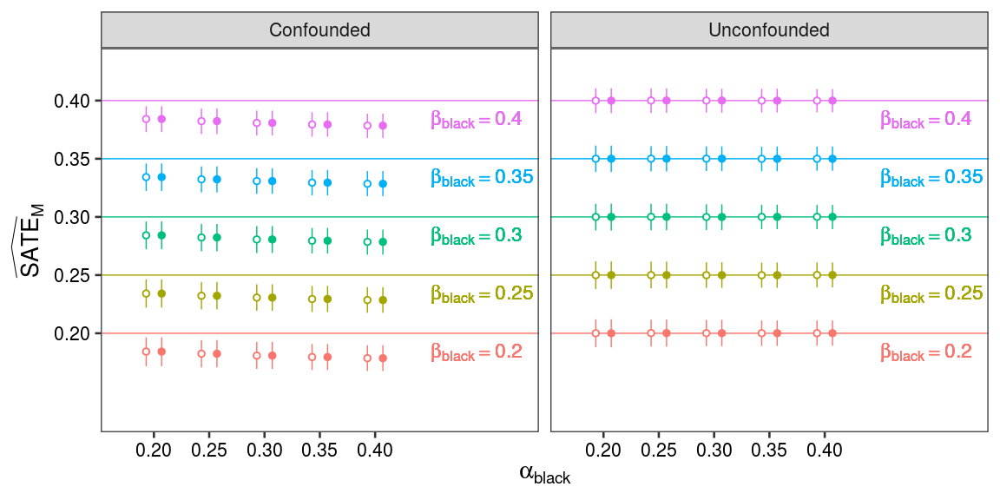

A sylized scenario
================
Gaebler et al.
Tuesday, October 11, 2020

``` r
library(rlang)
library(tidymodels)
```

    ## Registered S3 methods overwritten by 'tibble':
    ##   method     from  
    ##   format.tbl pillar
    ##   print.tbl  pillar

    ## Registered S3 method overwritten by 'xts':
    ##   method     from
    ##   as.zoo.xts zoo

    ## ── Attaching packages ────────────────────────────────────── tidymodels 0.1.0 ──

    ## ✔ broom     0.5.6      ✔ recipes   0.1.12
    ## ✔ dials     0.0.6      ✔ rsample   0.0.6 
    ## ✔ dplyr     1.0.7      ✔ tibble    3.0.1 
    ## ✔ ggplot2   3.2.1      ✔ tune      0.1.0 
    ## ✔ infer     0.5.1      ✔ workflows 0.1.1 
    ## ✔ parsnip   0.1.1      ✔ yardstick 0.0.6 
    ## ✔ purrr     0.3.3

    ## ── Conflicts ───────────────────────────────────────── tidymodels_conflicts() ──
    ## ✖ purrr::%@%()         masks rlang::%@%()
    ## ✖ purrr::as_function() masks rlang::as_function()
    ## ✖ purrr::discard()     masks scales::discard()
    ## ✖ dplyr::filter()      masks stats::filter()
    ## ✖ purrr::flatten()     masks rlang::flatten()
    ## ✖ purrr::flatten_chr() masks rlang::flatten_chr()
    ## ✖ purrr::flatten_dbl() masks rlang::flatten_dbl()
    ## ✖ purrr::flatten_int() masks rlang::flatten_int()
    ## ✖ purrr::flatten_lgl() masks rlang::flatten_lgl()
    ## ✖ purrr::flatten_raw() masks rlang::flatten_raw()
    ## ✖ purrr::invoke()      masks rlang::invoke()
    ## ✖ dplyr::lag()         masks stats::lag()
    ## ✖ purrr::list_along()  masks rlang::list_along()
    ## ✖ ggplot2::margin()    masks dials::margin()
    ## ✖ purrr::modify()      masks rlang::modify()
    ## ✖ purrr::prepend()     masks rlang::prepend()
    ## ✖ purrr::splice()      masks rlang::splice()
    ## ✖ recipes::step()      masks stats::step()

``` r
library(tidyverse)
```

    ## ── Attaching packages ─────────────────────────────────────── tidyverse 1.3.0 ──

    ## ✔ tidyr   1.0.2     ✔ stringr 1.4.0
    ## ✔ readr   1.3.1     ✔ forcats 0.4.0

    ## ── Conflicts ────────────────────────────────────────── tidyverse_conflicts() ──
    ## ✖ purrr::%@%()         masks rlang::%@%()
    ## ✖ purrr::as_function() masks rlang::as_function()
    ## ✖ readr::col_factor()  masks scales::col_factor()
    ## ✖ purrr::discard()     masks scales::discard()
    ## ✖ dplyr::filter()      masks stats::filter()
    ## ✖ stringr::fixed()     masks recipes::fixed()
    ## ✖ purrr::flatten()     masks rlang::flatten()
    ## ✖ purrr::flatten_chr() masks rlang::flatten_chr()
    ## ✖ purrr::flatten_dbl() masks rlang::flatten_dbl()
    ## ✖ purrr::flatten_int() masks rlang::flatten_int()
    ## ✖ purrr::flatten_lgl() masks rlang::flatten_lgl()
    ## ✖ purrr::flatten_raw() masks rlang::flatten_raw()
    ## ✖ purrr::invoke()      masks rlang::invoke()
    ## ✖ dplyr::lag()         masks stats::lag()
    ## ✖ purrr::list_along()  masks rlang::list_along()
    ## ✖ ggplot2::margin()    masks dials::margin()
    ## ✖ purrr::modify()      masks rlang::modify()
    ## ✖ purrr::prepend()     masks rlang::prepend()
    ## ✖ readr::spec()        masks yardstick::spec()
    ## ✖ purrr::splice()      masks rlang::splice()

``` r
library(furrr)
```

    ## Loading required package: future

    ## 
    ## Attaching package: 'future'

    ## The following object is masked from 'package:rmarkdown':
    ## 
    ##     run

``` r
# Set number of workers.
plan(multicore, workers = 4)

# Set the ggplot theme.
theme_set(theme_bw(base_size = 20))
```

# Overview

We construct a stylized example demonstrating that subset ignorability
is sufficient to estimate the
, the second-stage sample average treatment effect. Our
simulation models a city where police officers encounter many residents.
When an officer encounters a resident, the officer observes whether the
resident is actively engaging in a drug transaction
() and forms an
impression of their race (). The officer then decides whether or not to arrest the individual
(). The officer
generates a report about the encounter which indictes whether there was
a drug transaction ().
If the officer arrests the resident, the report, in which the officer
also records their perception of the resident’s race, is transmitted to
the prosecutor, along with the resident’s criminal history
(). The prosecutor then
makes a decision about whether to charge the resident with a crime
() based only on the
information contained in these documents, viz., the individual’s
criminal history, whether the individual was reported to be engaged in a
drug transaction, and the race indicated in the report
().

The object is to understand whether the prosecutor’s charging decisions
are motivated by racial animus, subject to the limitation that only data
on arrested individuals () are
available.

# Setup

A “book of life” is a draw of each potential outcome for a population of
a given size. We’ll define a function that generates a book of life for
a given set of parameters. The meanings of the parameters matches the
manuscript, and are re-explained as we go over each of the three steps
in the data generating process.

``` r
gen_book_of_life <- function(
  pop_size,
  mu_L,
  mu_X,
  delta,
  mu_A,
  gamma_,
  alpha_0,
  alpha_A,
  alpha_black,
  lambda_0,
  lambda_A,
  lambda_black,
  beta_0,
  beta_X,
  beta_R,
  beta_black,
  ...
) {
  # Define the structural equations.
  f_S <- function(u_L) {
    return(factor(if_else(u_L == 1, "b", "w"), levels = c("w", "b")))
  }

  f_D <- identity

  f_A <- function(u_A, u_L) {
    val <- mu_A + u_L * gamma_
    return(u_A <= val)
  }

  f_X <- function(u_X, u_L){
    val <- mu_X + u_L * delta
    return(u_X <= val)
  }
  
  f_M <- function(d, a, u_M) {
    val <- alpha_0 + a * alpha_A + (d == "b") * alpha_black
    return(u_M <= val)
  }

  f_Z <- function(d, m) {
    if_else(m, d, na_int)
  }

  f_R <- function(d, a, m, u_R) {
    val <- if_else(
      m,
      lambda_0 + a * lambda_A + (d == "b") * lambda_black,
      na_dbl
    )
    return(u_R <= val)
  }
  
  f_Y <- function(z, m, r, x, u_Y) {
    val <- beta_0 + x * beta_X + r * beta_R + (z == "b") * beta_black
    return(replace_na(u_Y <= val, FALSE))
  }
  
  # Generate the book of life.
  book_of_life <- tibble(
      # Generate the exogenous variables.
      U_L = as.logical(rbinom(pop_size, 1, mu_L)),
      U_A = runif(pop_size),
      U_X = runif(pop_size),
      U_R = runif(pop_size),
      U_M = runif(pop_size),
      U_Y = runif(pop_size),
      
      # Generate the endogenous variables.
      S = f_S(U_L),
      D = f_D(S),
      A = f_A(U_A, U_L),
      X = f_X(U_X, U_L),
      M = f_M(D, A, U_M),
      Z = f_Z(D, M),
      R = f_R(D, A, M, U_R),
      Y = f_Y(Z, M, R, X, U_Y),

      # Generate the potential outcomes.
      M_w = f_M("w", A, U_M),
      M_b = f_M("b", A, U_M),
      Y_w_1 = f_Y("w", rep(TRUE, pop_size), R, X, U_Y),
      Y_b_1 = f_Y("b", rep(TRUE, pop_size), R, X, U_Y)
  )
}
```

Next, we define two convenience function which, given the book of life,
produce the stratified difference-in-means and linear regression
estimates, both when the covariate R is and is not observed. These
functions also return the standard error, computed according to Eq. (9)
in the case of the stratified difference-in-means estimator and
according to the standard calculation for linear models.

``` r
extract_sdm <- function(book_of_life) {
  confounded <- book_of_life %>%
    filter(M) %>%
    group_by(Z, X) %>%
    summarize(c_zx = mean(Y), S_zx = n(), .groups = 'drop') %>%
    group_by(X) %>%
    summarize(
      n_x = sum(S_zx),
      se_x = sum(c_zx * (1 - c_zx) / S_zx),
      diff_in_means = sum((Z == "b") * c_zx - (Z == "w") * c_zx),
      .groups='drop'
    ) %>%
    summarize(
      estimate = sum(n_x * diff_in_means) / sum(n_x),
      se = sqrt(sum((n_x / sum(n_x))^2 * se_x))
    )
  
  unconfounded <- book_of_life %>%
    filter(M) %>%
    group_by(Z, X, R) %>%
    summarize(c_zxr = mean(Y), S_zxr = n(), .groups='drop') %>%
    group_by(X, R) %>%
    summarize(
      n_xr = sum(S_zxr),
      se_xr = sum(c_zxr * (1 - c_zxr) / S_zxr),
      diff_in_means = sum((Z == "b") * c_zxr - (Z == "w") * c_zxr),
      .groups='drop'
    ) %>%
    summarize(
      estimate = sum(n_xr * diff_in_means) / sum(n_xr),
      se = sqrt(sum((n_xr / sum(n_xr))^2 * se_xr))
    )
  
  rbind(confounded, unconfounded) %>%
    mutate(confounded = c('Confounded', 'Unconfounded'))
}

extract_lpm <- function(book_of_life) {
  confounded <- book_of_life %>%
    filter(M) %>%
    lm(formula = Y ~ X + Z, data = .) %>%
    tidy() %>%
    filter(term == "Zb") %>%
    select(estimate = estimate, se = std.error)
  
  unconfounded <- book_of_life %>%
    filter(M) %>%
    lm(formula = Y ~ X + R + Z, data = .) %>%
    tidy() %>%
    filter(term == "Zb") %>%
    select(estimate = estimate, se = std.error)
  
  rbind(confounded, unconfounded) %>%
    mutate(confounded = c('Confounded', 'Unconfounded'))
}
```

# Simulation

We now turn to the simulation itself.

## Estimates

We’ll generate estimates using the following grid of parameters.

``` r
params <- expand_grid(
  pop_size = 1e5,
  mu_L = 0.3,
  mu_X = 0.3,
  delta = 0.1,
  mu_A = 0.3,
  gamma_ = -0.1,
  alpha_0 = 0.1,
  alpha_A = 0.3,
  alpha_black = seq(from = 0.2, to = 0.4, by = 0.05),
  lambda_0 = 0.2,
  lambda_A = 0.6,
  lambda_black = 0.1,
  beta_0 = 0.2,
  beta_X = 0.2,
  beta_R = 0.2,
  beta_black = seq(from = 0.2, to = 0.4, by = 0.05)
)
```

Our estimates are then as follows:

``` r
gen_sim_results <- function(params, n = 1) {
  one_run <- function(...) {
    params %>% 
      mutate(
        books_of_life = pmap(., gen_book_of_life),
        sdm = map(books_of_life, extract_sdm),
        lpm = map(books_of_life, extract_lpm),
      ) %>%
      unnest(cols = c("sdm", "lpm"), names_sep = "_") %>%
      select(-books_of_life, -sdm_confounded) %>%
      rename(confounded = lpm_confounded)
  }
  
  results <- future_map_dfr(
    1:n,
    one_run,
    .options = future_options(seed = TRUE)
  )
}

set.seed(1)
unisim <- gen_sim_results(params)
```

We can plot them to see how well our estimates perform. (Note that in
this setup, the
 is exactly equal to
.) We use a normal approximation to generate
our 95% confidence intervals.

``` r
unisim %>%
  ggplot(aes(x = alpha_black, color = as_factor(beta_black))) +
  facet_wrap(vars(confounded)) + 
  geom_hline(aes(yintercept = beta_black, color = as_factor(beta_black))) + 
  geom_pointrange(
    aes(
      y = sdm_estimate,
      ymin = sdm_estimate - 1.96 * sdm_se,
      ymax = sdm_estimate + 1.96 * sdm_se
    ),
    position = position_nudge(x = 0.007)
  ) +
  geom_pointrange(
    aes(
      y = lpm_estimate,
      ymin = lpm_estimate - 1.96 * lpm_se,
      ymax = lpm_estimate + 1.96 * lpm_se
    ),
    position = position_nudge(x = -0.007),
    shape = 21,
    fill = "white"
  ) +
  geom_text(
    mapping = aes(
      x = max(params$alpha_black),
      y = beta_black,
      label = str_c("beta[black] == ", beta_black)
    ),
    hjust = 0,
    vjust = 1.5,
    size = 6,
    parse = TRUE,
    position = position_nudge(x = 0.05)
  ) +
  scale_x_continuous(
    limits = c(min(params$alpha_black) - 0.03, max(params$alpha_black) + 0.13),
    breaks = sort(unique(params$alpha_black))
  ) +
  scale_y_continuous(
    limits = c(min(params$beta_black) - 0.07, max(params$beta_black) + 0.03),
    breaks = sort(unique(params$beta_black))
  ) + 
  labs(
    x = expr(alpha[black]),
    y = expr(widehat(SATE)[M])
  ) +
  theme(
    legend.position = "none",
    axis.title = element_text(size = 20, face = "bold"),
    axis.text = element_text(color = "black"),
    panel.grid.minor = element_blank(),
    panel.grid.major = element_blank()
  )
```

<!-- -->

We also want to plot the results of many simulations to see what the
distribution of the estimator is. We’ll do 10,000 simuations of size
100,000 to see what happens.

``` r
set.seed(2)
millisim <- gen_sim_results(params, 1e4)

# Calculate 95% centered coverage and plot for the estimates.
millisim %>%
  group_by(alpha_black, beta_black, confounded) %>%
  summarize(
    sdm_lower = quantile(sdm_estimate, probs = 0.025),
    sdm_upper = quantile(sdm_estimate, probs = 0.975),
    sdm_estimate = mean(sdm_estimate),
    lpm_lower = quantile(lpm_estimate, probs = 0.025),
    lpm_upper = quantile(lpm_estimate, probs = 0.975),
    lpm_estimate = mean(lpm_estimate),
    .groups = 'drop'
  ) %>%
  ggplot(aes(x = alpha_black, color = as_factor(beta_black))) +
  facet_wrap(vars(confounded)) +
  geom_hline(aes(yintercept = beta_black, color = as_factor(beta_black))) + 
  geom_pointrange(
    aes(y = sdm_estimate, ymin = sdm_lower, ymax = sdm_upper),
    position = position_nudge(x = 0.007)
  ) +
  geom_pointrange(
    aes(y = lpm_estimate, ymin = lpm_lower, ymax = lpm_upper),
    position = position_nudge(x = -0.007),
    shape = 21,
    fill = "white"
  ) +
  geom_text(
    mapping = aes(
      x = max(params$alpha_black),
      y = beta_black,
      label = str_c("beta[black] == ", beta_black)
    ),
    hjust = 0,
    vjust = 1.5,
    size = 6,
    parse = TRUE,
    position = position_nudge(x = 0.05)
  ) +
  scale_x_continuous(
    limits = c(min(params$alpha_black) - 0.03, max(params$alpha_black) + 0.13),
    breaks = sort(unique(params$alpha_black))
  ) +
  scale_y_continuous(
    limits = c(min(params$beta_black) - 0.07, max(params$beta_black) + 0.03),
    breaks = sort(unique(params$beta_black))
  ) + 
  labs(
    x = expr(alpha[black]),
    y = expr(widehat(SATE)[M])
  ) +
  theme(
    legend.position = "none",
    axis.title = element_text(size = 20, face = "bold"),
    axis.text = element_text(color = "black"),
    panel.grid.minor = element_blank(),
    panel.grid.major = element_blank()
  )
```

<!-- -->

``` r
ggsave('figures/millisim.pdf', height = 6, width = 12)
```

## Confidence Intervals

We want to check the true coverage rate of the confidence intervals
we’ve calculated. For each of the 10,000 simulations of each of the 25
parameter combinations, we check whether the calculated value falls
within the 95% confidence interval.

``` r
coverage <- millisim %>%
  group_by(confounded, alpha_black, beta_black) %>%
  mutate(
    sdm_lower = sdm_estimate - 1.96 * sdm_se,
    sdm_upper = sdm_estimate + 1.96 * sdm_se,
    sdm_coverage = sdm_lower <= beta_black & sdm_upper >= beta_black,
    lpm_lower = lpm_estimate - 1.96 * lpm_se,
    lpm_upper = lpm_estimate + 1.96 * lpm_se,
    lpm_coverage = lpm_lower <= beta_black & lpm_upper >= beta_black
  ) %>%
  summarize_at(vars(sdm_coverage, lpm_coverage), mean)

coverage %>% print(n=Inf)
```

    ## # A tibble: 50 x 5
    ## # Groups:   confounded, alpha_black [10]
    ##    confounded   alpha_black beta_black sdm_coverage lpm_coverage
    ##    <chr>              <dbl>      <dbl>        <dbl>        <dbl>
    ##  1 Confounded          0.2        0.2        0.298        0.292 
    ##  2 Confounded          0.2        0.25       0.282        0.275 
    ##  3 Confounded          0.2        0.3        0.268        0.261 
    ##  4 Confounded          0.2        0.35       0.256        0.249 
    ##  5 Confounded          0.2        0.4        0.224        0.221 
    ##  6 Confounded          0.25       0.2        0.178        0.174 
    ##  7 Confounded          0.25       0.25       0.165        0.160 
    ##  8 Confounded          0.25       0.3        0.152        0.148 
    ##  9 Confounded          0.25       0.35       0.136        0.130 
    ## 10 Confounded          0.25       0.4        0.120        0.115 
    ## 11 Confounded          0.3        0.2        0.0975       0.0942
    ## 12 Confounded          0.3        0.25       0.0852       0.0823
    ## 13 Confounded          0.3        0.3        0.0801       0.0771
    ## 14 Confounded          0.3        0.35       0.0746       0.0706
    ## 15 Confounded          0.3        0.4        0.0594       0.0547
    ## 16 Confounded          0.35       0.2        0.0551       0.0535
    ## 17 Confounded          0.35       0.25       0.0488       0.0467
    ## 18 Confounded          0.35       0.3        0.0455       0.0427
    ## 19 Confounded          0.35       0.35       0.0393       0.0366
    ## 20 Confounded          0.35       0.4        0.0308       0.0266
    ## 21 Confounded          0.4        0.2        0.0337       0.0325
    ## 22 Confounded          0.4        0.25       0.0318       0.0302
    ## 23 Confounded          0.4        0.3        0.0246       0.0233
    ## 24 Confounded          0.4        0.35       0.0247       0.0218
    ## 25 Confounded          0.4        0.4        0.0166       0.0148
    ## 26 Unconfounded        0.2        0.2        0.950        0.950 
    ## 27 Unconfounded        0.2        0.25       0.951        0.950 
    ## 28 Unconfounded        0.2        0.3        0.953        0.954 
    ## 29 Unconfounded        0.2        0.35       0.949        0.951 
    ## 30 Unconfounded        0.2        0.4        0.957        0.958 
    ## 31 Unconfounded        0.25       0.2        0.951        0.951 
    ## 32 Unconfounded        0.25       0.25       0.950        0.950 
    ## 33 Unconfounded        0.25       0.3        0.948        0.948 
    ## 34 Unconfounded        0.25       0.35       0.952        0.953 
    ## 35 Unconfounded        0.25       0.4        0.952        0.953 
    ## 36 Unconfounded        0.3        0.2        0.951        0.951 
    ## 37 Unconfounded        0.3        0.25       0.953        0.954 
    ## 38 Unconfounded        0.3        0.3        0.948        0.948 
    ## 39 Unconfounded        0.3        0.35       0.952        0.952 
    ## 40 Unconfounded        0.3        0.4        0.953        0.951 
    ## 41 Unconfounded        0.35       0.2        0.952        0.953 
    ## 42 Unconfounded        0.35       0.25       0.951        0.952 
    ## 43 Unconfounded        0.35       0.3        0.954        0.954 
    ## 44 Unconfounded        0.35       0.35       0.948        0.947 
    ## 45 Unconfounded        0.35       0.4        0.949        0.946 
    ## 46 Unconfounded        0.4        0.2        0.948        0.949 
    ## 47 Unconfounded        0.4        0.25       0.949        0.95  
    ## 48 Unconfounded        0.4        0.3        0.953        0.952 
    ## 49 Unconfounded        0.4        0.35       0.946        0.945 
    ## 50 Unconfounded        0.4        0.4        0.952        0.947

Briefly reviewing our table of estimates shows that our coverage is
roughly 95% for all of the confidence intervals in the unconfounded
scenario. In the confounded scenario, the intervals rarely cover the
true values, as expected.
